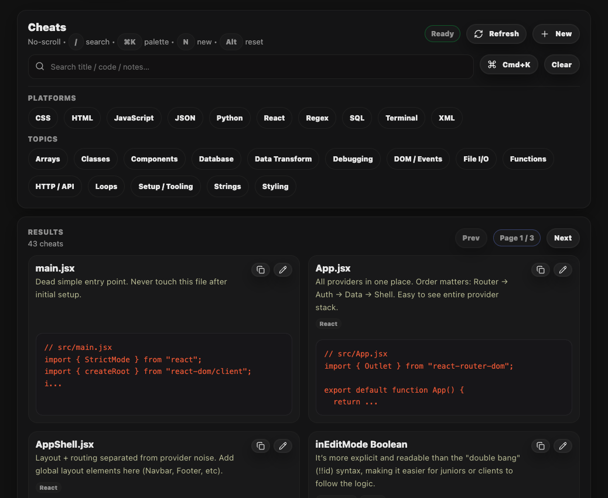
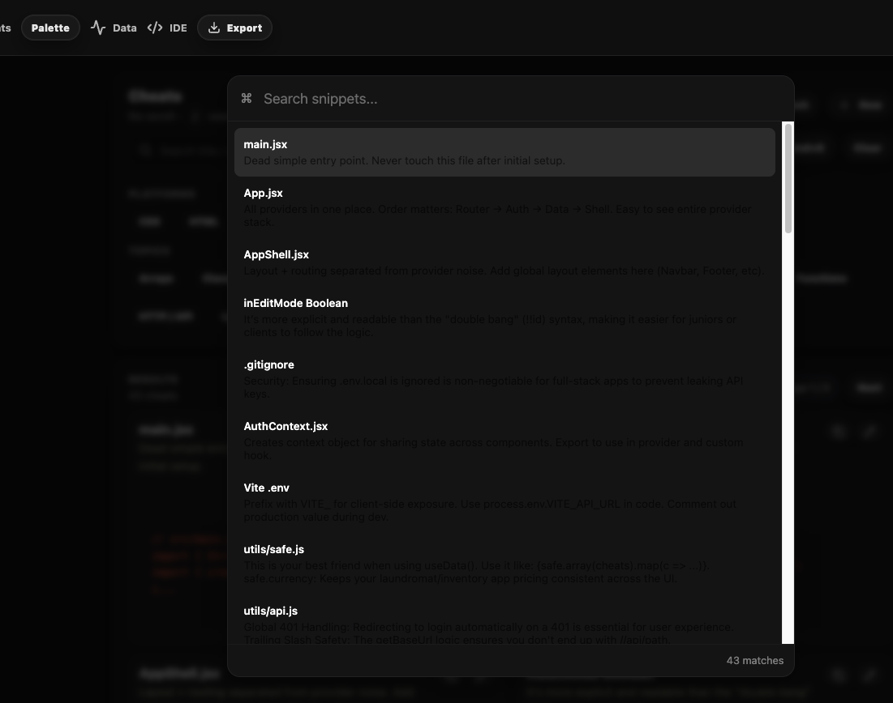
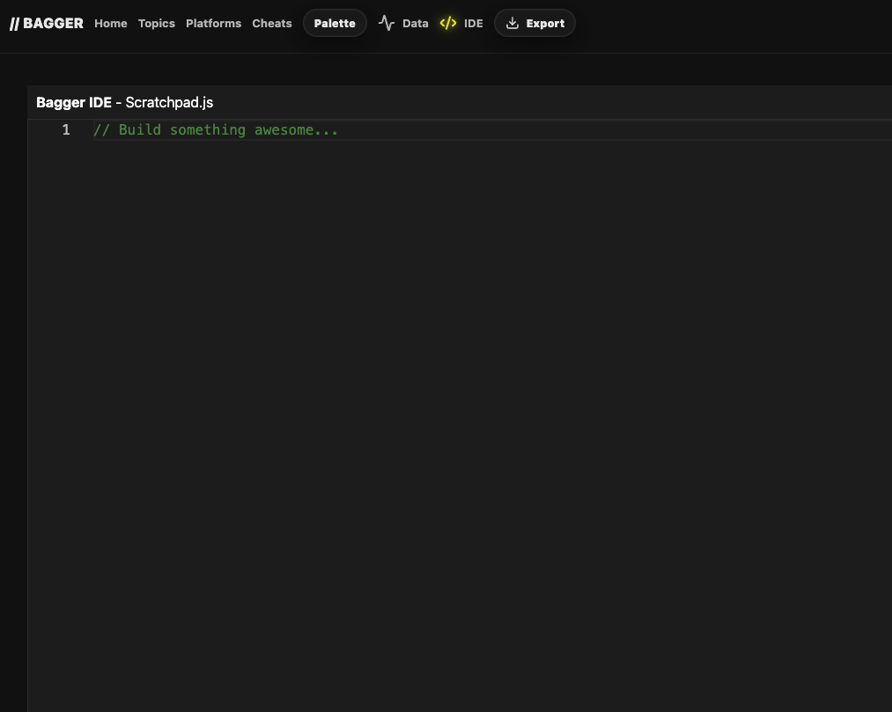
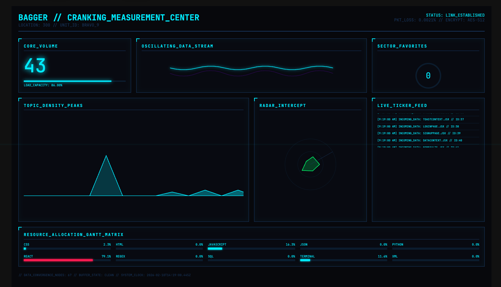
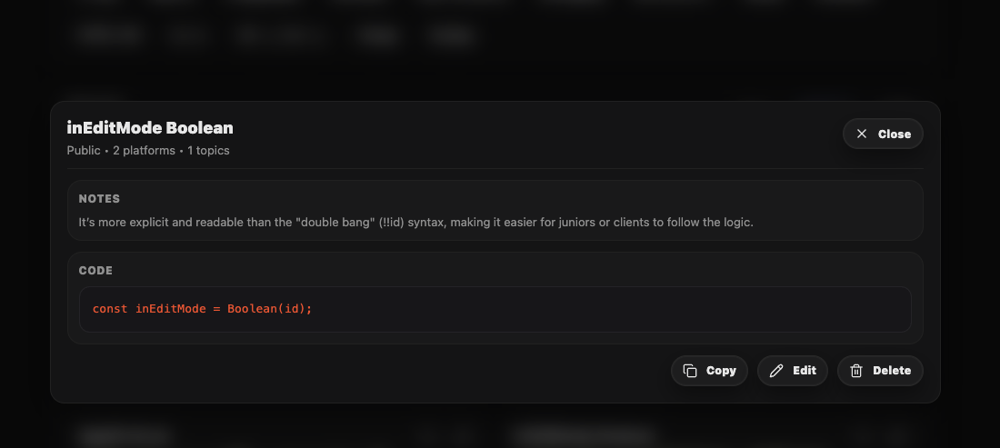

# BAGGER

> **TL;DR for recruiters:**
> Full-stack developer knowledge system built with React + Flask.
> Authenticated CRUD architecture with clean domain modeling and reusable UI abstractions.
> Demonstrates production-aware frontend + backend patterns.

---


---

# Overview

Bagger is a keyboard-first developer knowledge command center.

It organizes code snippets (“Cheats”) by Platform and Topic, with authentication, analytics, and a reusable UI architecture.

---

# Application Screenshots

## Cheats Dashboard

Filtering by Platform + Topic with fast copy/edit actions.



---

## Command Palette

Global search (`⌘K`) for instant snippet retrieval.



---

## Embedded IDE View

Scratchpad-style internal IDE for experimentation.



---

## Analytics / Data View

High-signal visual metrics and system status.



---

## Reusable Form System

Abstracted BaseForm powering all entity creation.



---

# Architecture

```
src/
├── components/
│   ├── base/        → Reusable abstraction layer
│   ├── cheats/      → Cheat domain UI
│   ├── platforms/   → Platform UI
│   ├── topics/      → Topic UI
│   └── shared/      → Shell, navbar, toasts, skeletons
├── contexts/        → Auth, Data, Toast
├── providers/       → Business logic + caching layer
├── hooks/           → useAuth, useData, useToast
├── pages/           → Route-level views
└── utils/           → API abstraction + safety helpers
```

## Backend Structure

```
models/      → SQLAlchemy domain models
routes/      → HTTP layer
schemas/     → Serialization layer
utils/       → Auth helpers
migrations/  → Alembic history
```

---

# Example API Interaction

```js
api.get("/cheats");
api.post("/platforms", payload);
```

### Example Response

```json
{
  "id": 12,
  "title": "inEditMode Boolean",
  "notes": "Explicit boolean casting improves readability.",
  "code": "const inEditMode = Boolean(id);",
  "platformIds": [1],
  "topicIds": [3]
}
```

---

# Production Readiness

Demonstrates:

- Token-based authentication
- Layered architecture
- Centralized API abstraction
- Cache strategy (TTL)
- Global 401 handling
- Migration-based schema evolution
- Clean separation of concerns

---

# Local Development

### Frontend

```
npm install
npm run dev
```

### Backend

```
python -m venv venv
source venv/bin/activate
pip install -r requirements.txt
flask run --port 8080
```

---

# License

### MIT License

Permission is hereby granted, free of charge, to any person obtaining a copy
of this software and associated documentation files (the "Software"), to deal
in the Software without restriction, including without limitation the rights

to use, copy, modify, merge, publish, distribute, sublicense, and/or sell
copies of the Software, and to permit persons to whom the Software is
furnished to do so, subject to the following conditions:

The above copyright notice and this permission notice shall be included in all
copies or substantial portions of the Software.

THE SOFTWARE IS PROVIDED "AS IS", WITHOUT WARRANTY OF ANY KIND, EXPRESS OR
IMPLIED, INCLUDING BUT NOT LIMITED TO THE WARRANTIES OF MERCHANTABILITY,
FITNESS FOR A PARTICULAR PURPOSE AND NONINFRINGEMENT. IN NO EVENT SHALL THE
AUTHORS OR COPYRIGHT HOLDERS BE LIABLE FOR ANY CLAIM, DAMAGES OR OTHER
LIABILITY, WHETHER IN AN ACTION OF CONTRACT, TORT OR OTHERWISE, ARISING FROM,
OUT OF OR IN CONNECTION WITH THE SOFTWARE OR THE USE OR OTHER DEALINGS IN THE
SOFTWARE.

Built by Josh Dicker — full-stack developer focused on scalable architecture and pragmatic systems design.
